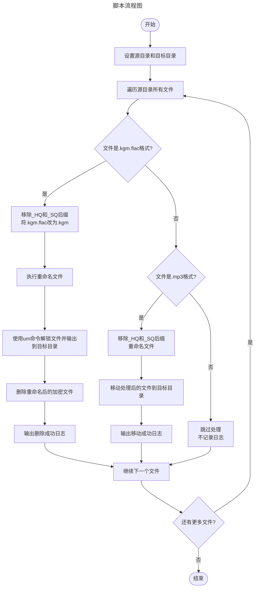

## 准备

::: steps
1. 
    - 下载 [Termux](./termux.md#下载-termux) 并安装
    - 下载并安装 [MT 管理器](https://mt2.cn/download/) <badge text="非必须，但推荐" type="tip" />
    - 下载 [Unlock Music CLI 版](https://git.um-react.app/um/cli/releases/latest)，选择 Linux arm64 版本

2. 解压 `um-linux-arm64-vx.x.xx.tar.gz` 并将 `um` 移动到系统目录
    - 解压 `um-linux-arm64-vx.x.xx.tar.gz`
      > 可用 MT 管理器解压 
    - 设置外部存储访问权限
      ```bash
      termux-setup-storage
      ```
    - 在 Termux 中运行以下命令：
      ```bash
      mv /storage/emulated/0/Download/um $PREFIX/bin/
      ```

      ::: note
      `/storage/emulated/0/Download/um` 是你解压 `um` 后的 `um` 实际文件路径
      :::
3. 授予执行权限
    ```bash
    chmod 550 $PREFIX/bin/um
    ```
4. 检查是否安装成功
    ```bash
    um -h
    ```
:::

## 使用
```bash
um -i /storage/emulated/0/Download/KuGouLite/Music -o /storage/emulated/0/Music
```

::: tip
`-i` 参数指定你要解锁的歌曲目录，`-o` 参数指定你要输出的歌曲目录。
:::

## 扩展
下面是我自用的一个脚本，可以自动解锁酷狗概念版下载的歌曲并输出到指定目录，再自动删除源文件：

```bash title="um.sh"
#!/bin/bash

source_dir="/storage/emulated/0/Download/KuGouLite/Music/"
destination="/storage/emulated/0/Music/"

for file in "$source_dir"*; do
    timestamp=$(date -u +"%Y-%m-%dT%H:%M:%SZ")
    warning="\033[1;33mWARNING\033[0m"
    
    if [[ "$file" == *.kgm.flac ]]; then
        new_file="${file//_HQ/}"
        new_file="${new_file//_SQ/}"
        new_file="${new_file//.kgm.flac/.kgm}"
        mv -- "$file" "$new_file"
        um -i "$new_file" -o "$destination"
        rm "$new_file"
        echo -e "$timestamp    $warning    successfully removed \"$new_file\""
    elif [[ "$file" == *.mp3 ]]; then
        new_file="${file//_HQ/}"
        new_file="${new_file//_SQ/}"
        if [[ "$file" != "$new_file" ]]; then
            mv -- "$file" "$new_file"
            file="$new_file"
        fi
        mv -- "$file" "$destination"
        echo -e "$timestamp    $warning    successfully moved \"$file\" to \"$destination$(basename "$file")\""
    fi
done
```

